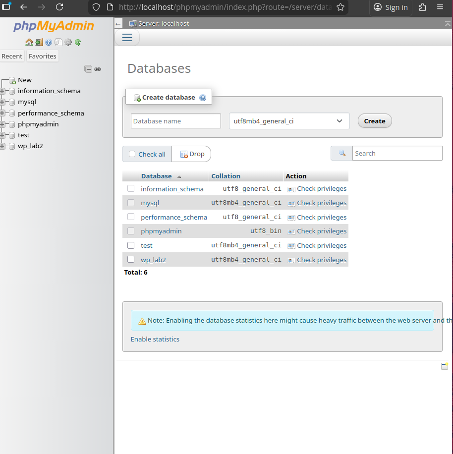
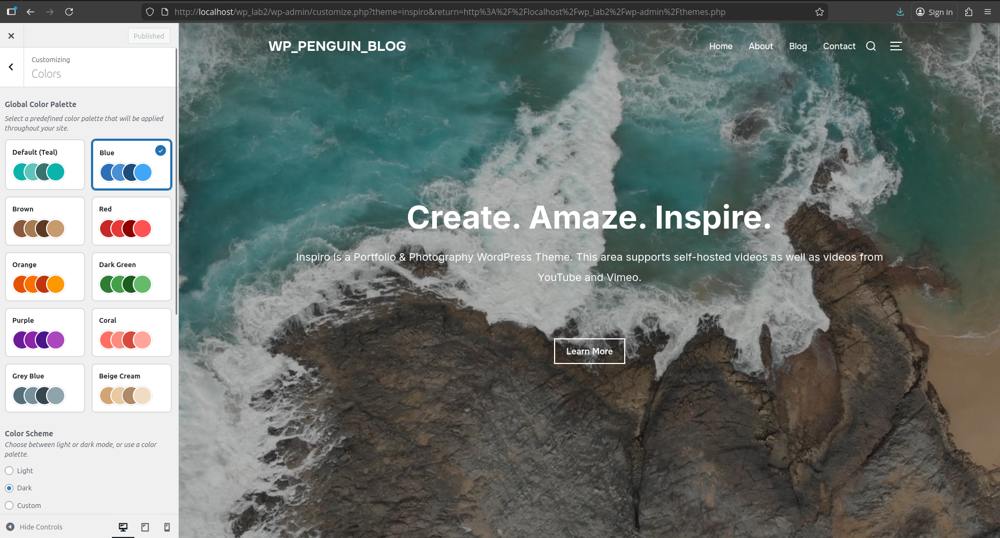
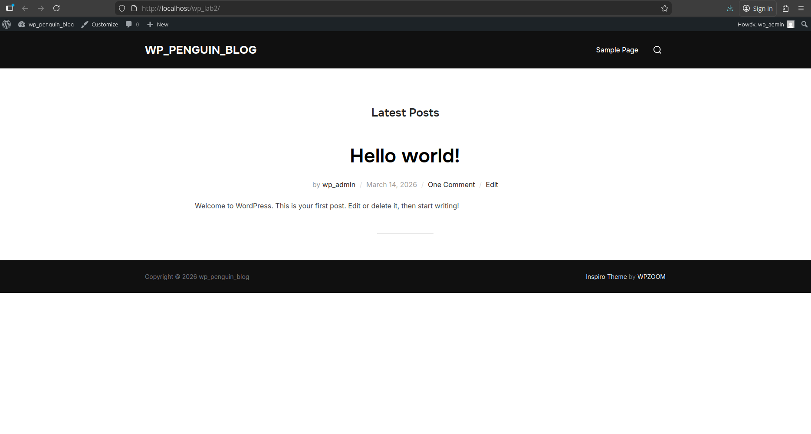
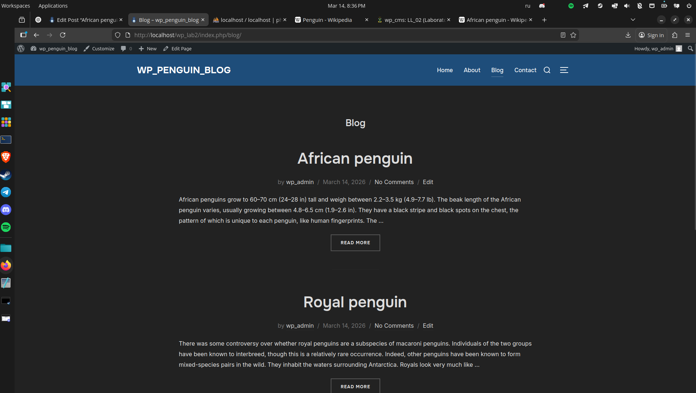
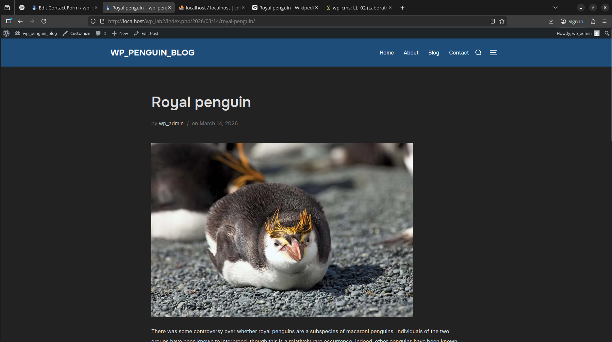
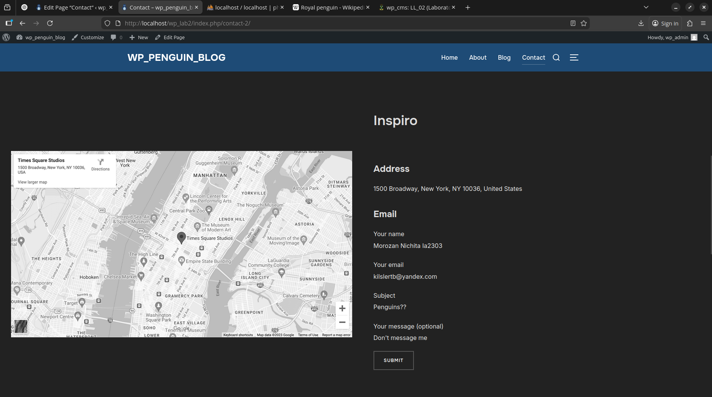
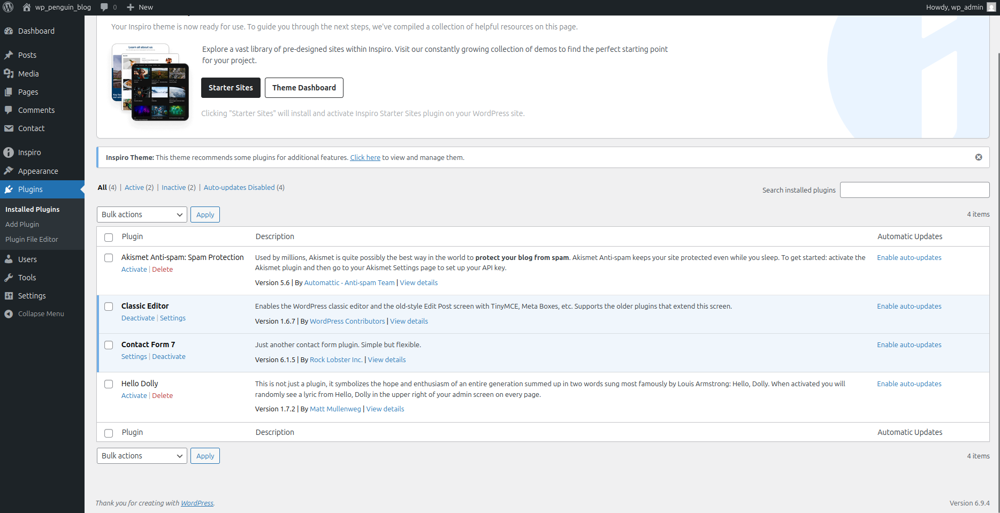

# Лабораторная работа №2. Введение в WordPress
## Цель работы: Научиться устанавливать WordPress в локальной среде, познакомиться с панелью администратора, изменять внешний вид сайта с помощью тем и расширять его функциональность при помощи плагинов.

## Шаг 1. Подготовка среды
1. Установка XAMPP
2. Включить модули Mysql, Apache
3. Создать базу данных
5. Скачать и установить Wordpress в папку htdocs

## Шаг 2. Создание сайта
1. После распаковки архива вордпресса зайти по адрессу `localhost/wp_lab2`
2. Заполнить форму и продолжить создание сайта
3. Авторизироваться созданным аккаунтом
## Шаг 3. Первоначальные настройки сайта
1. Измени название сайта `wp_penguin_blog` и часовой пояс `UTC+3` => `UTC+2`
2. Настрой постоянные ссылки `http://localhost/wp_lab2` => `http://localhost/wp_lab2`

## Шаг 4. Работа с темами

1. Смена темы : Внешний вид => Темы => Avanterex Automobile
2. Сравнение результат
3. Настройка темы: 
Смена лого
Смена названия
Смена цветовой схемы

## Сравнение сайта до->после

## Шаг 5. Работа с плагинами
1. Установка Classic Editor
Добавление возможности создавать посты
2. Установка Contact Form 7
Создание формы с контактом.

3. Отключение плагинов

## Шаг 6. Создание контента

## Контрольные вопросы
Что делает тема и что делает плагин в WordPress?  
Тема - определеяет внешний вид сайта: шрифт, цвета, офромление страниц и расположение блоков.  
Плагин -  добавляет новые функции и возможности, которые не входят в стандарт WordPress.  
Почему контент сайта не теряется при смене темы?  
WordPress хранит контент отдельно от темы:Текст постов, страницы, изображения, комментарии хранятся в базе данных MySQL.  
Как можно изменить внешний вид сайта без редактирования кода?
Использовать Настройки => Внешний вид => Настроить(логотип сайта,цвета, шрифты, фон,расположение виджетов,меню).  
Или установить другую тему.
